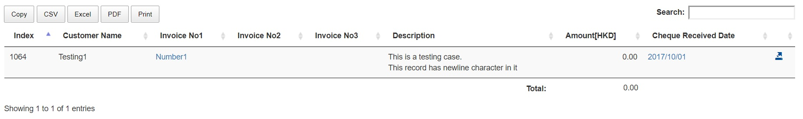

<br/>

[DataTables](https://m.datatables.net/) is a useful JQuery plugin that allows simple manipulation of table in web development.

I mainly use DataTables daily for my current internship. DataTables is very useful in that

- it allows fixed column and search features that are difficult to implement with pure JavaScript.
- it allows export functions to various format such as Excel, clipboard, PDF, and, print.

Export feature was particularly important to me because user of my system often like to download the dynamic table on the website to excel to do further manipulation.

The problem occurred when the record in table had newline character "\n". I though that DataTables would automatically handle the line break for me instead.

However, I realized that Excel has different rule for line break and it would not do so automatically.

<br/>

<figure class="floatCenter">
	
  <figcaption>Description record contains newline character "\n"</figcaption>
</figure>

<br/>

As a result, I looked into the problem more deeply and finally found the solution.

## Excel's way of line break
I found out that <strong>CHAR(10) & CHAR(13)</strong> is used for the line break. Although they perform similar task, CHAR(13) is interpreted as carriage return while CHAR(10) is viewed as line feed. Thus, it is usually the best practice to use them together to create line break.

Link: [Detailed explanation with examples](https://social.msdn.microsoft.com/Forums/sqlserver/en-US/a87b9fbb-40dc-4a2e-83df-eab150620122/difference-between-char13-and-char10?forum=transactsql)

In addition, DataTables also provide export options which allows user to define the format of export.
As a result, as shown in the code below, I have replaced "\n" character with &CHAR(10)&CHAR(13)&.

```javascript
exportOptions:
{
   stripHtml: false,
   format: {
     body: function ( data, column, row ) {
       return (column === 1 && column === 5) ? data.replace( /\n/g, '"&CHAR(10)&"' ) : data.replace(/(&nbsp;|<([^>]+)>)/ig, "");;
     }
   }
}
```

You might be wondering why I have added another replace statement with a lot of regular expression.

Basically, DataTables plugin strips away all the HTML tag within `<td>` tag. However, by using format option, we must strip away the tag by ourselves.
To do so, I referred to [this link](https://m.datatables.net/forums/discussion/43143/formating-data-when-exporting-to-excel-returns-data-with-html-code) to strip HTML tags.

<hr/>

## Wrap Text
Another issue was that even after replacing all `\n` to CHAR(10)&CHAR(13), Excel still did not display the result correctly.

After some googling, I found out that I must click "Wrap Text" button in Excel in order to display the line break.

Referring to documentation from [Datatables website], I must customize the worksheet with built in style.

```javascript
customize: function( xlsx ) {
	 var sheet = xlsx.xl.worksheets['sheet1.xml'];
	 $('row c', sheet).attr( 's', '55' );
}
```

In the above code, by adding s attribute with style 55 (wrapped text) to all the row, I was able to successfully break line for my exported Excel file.

<br/>

This example demonstrates the quirk of Excel styling but taught me some good lesson on JavaScript export functionality.

```javascript
$('#example').DataTable( {
  dom: 'Bfrtip',
  buttons: [ 'copy', 'csv',
	  {
	    extend: 'excelHtml5',
	    text: 'Excel',
	    exportOptions: {
	       stripHtml: false,
	       format: {
	         body: function ( data, column, row ) {
	           return (column === 1 && column === 5) ? data.replace( /\n/g, '"&CHAR(10)&CHAR(13)&"' ) : data.replace(/(&nbsp;|<([^>]+)>)/ig, "");;
	         }
	       }
	  	},
		  customize: function( xlsx ) {
		   		var sheet = xlsx.xl.worksheets['sheet1.xml'];
		      $('row c', sheet).attr( 's', '55' );
		   }
    },
    'pdf', 'print'
  ]
});
```
Full JQuery plugin code.

<br/>
