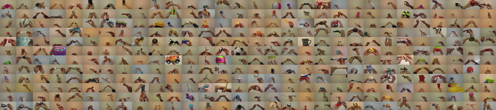

## AIVAS Lab, Vanderbilt University
It's been a busy semester for me since I was traveling all over United States and putting my time get good grades in Vanderbilt. However, most importantly, I feel like my biggest take away from my semester exchange was being able to participate in a research project here.

Under the supervision of *Dr. Maithilee Kunda*, I was working mainly on research topics that are related to Cognitive Science and Machine Learning. Fortunately, I was able to take part in a project called **Toybox.** Toybox dataset was first proposed by our PostDoc, *Xiaohan Wang*, who was interested in the infant learning process. Before we talk anything about the dataset, let's delve little deep into the world of Neural Network.

## History of Convolutional Neural Network

<figure class="floatCenter">
	
  <figcaption>Snapshots of our dataset</figcaption>
</figure>

As some of you may heard of already, Deep Learning, or more specifically [Deep Convolutional Neural Network](http://cs231n.github.io/convolutional-networks/) has been massively successful since the release of the renown paper by *Alex Krizhevsky, Ilya Sutskever, Geoffrey Hinton* from University of Toronto, also known as [AlexNet paper](https://papers.nips.cc/paper/4824-imagenet-classification-with-deep-convolutional-neural-networks.pdf). The naming of Neural Network comes from a fact that by the process of training, different neurons (essentially a node) in the network learns the features of a given class. In this process, we do not have to tell the network how the object looks like at all. With enough data and good computing power, the network learns to generalize. This process is very similar to how neurons work in the human brains and hence the naming. The use of DCNN architecture and multiple (two at that time) in AlexNet were critical to winning the 2012 [ImageNet](http://www.image-net.org/) Challenge.

Since then, a lot of great ideas were proposed by many bright minds over the world and we have seen some of them being implemented in the industry already like [Google Duplex](https://ai.googleblog.com/2018/05/duplex-ai-system-for-natural-conversation.html)! However, most of the training process of DCNN is done by feeding thousands of photos of objects with labels on them. A clear example of such data is ImageNet which was proposed by *Fei-Fei Li* from Stanford University and used Amazon Mechanical Turk to gather annotated images from hundreds of people. With such a immense amount of data and detailed categories, ImageNet helped researchers to create super-human level of image recognition ability by computer.

## Why Toybox

So enough of Machine Learning history then. Why use Toybox dataset then? Xiaohan, a Neuroscience Ph.D from Vanderbilt, believed that human, especially infants, don't learn to recognize new objects from third-person point of view. Rather, we learn from a first-person point of view or egocentric point of view by holding the objects with our hands and seeing the objects within the distance of our arm length. We also touch the new objects by hand and try to get a sense of what it is by rotating and moving it around. On the contrary, if you look at ImageNet dataset, almost all of them are photos of objects from some distance. He believed that there should be a supplementary dataset that integrates human learning process into the training process of DCNN if we want machine to have similar learning process as human.

Finally in the last month, our lab was able to finish recording thousands of videos with 360 different objects and 12 categories. These categories were specifically selected from **top 100 earliest learned nouns that US infants learn.** To share our dataset to the research community, we've submitted a paper to *Computer Vision and Pattern Recognition (CVPR)* 2018 workshop, [*Vision Meets Cognition*](http://www.visionmeetscognition.org/) with some preliminary experiments with the dataset. Luckily, we got accepted I will be traveling to Salt Lake City, Utah next week to attend the conference as one of the co-author. I will post more about my first conference experience after I come back.  

I believe that our dataset can have many meaningful applications in the field of Machine Learning. You can find more details about our dataset in our official dataset website: [aivaslab.github.io/toybox](https://aivaslab.github.io/toybox) (the website was developed by me) or contact [toybox@vanderbilt.edu](mailto:toybox@vanderbilt.edu).

 
